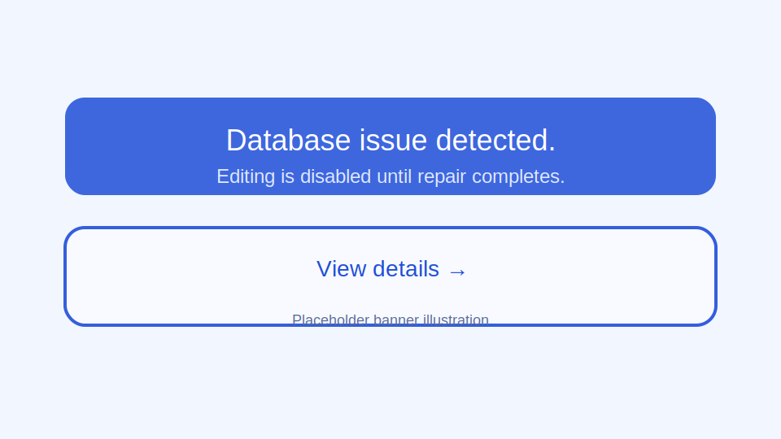
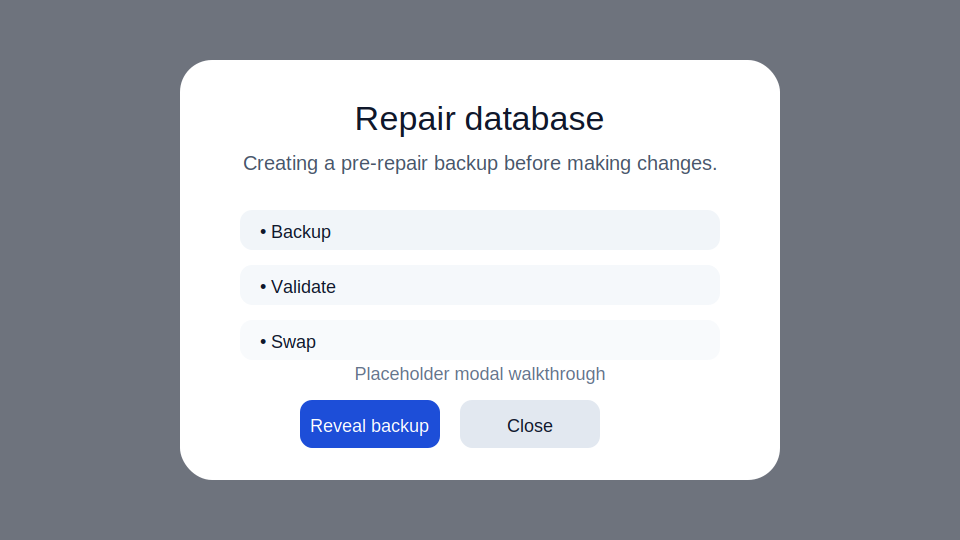
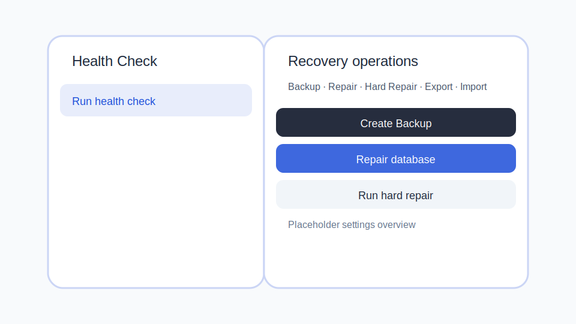

# Data Safety & Recovery Guide

This guide explains the tools that keep the database healthy and recoverable. Each section covers when to use the action, what happens behind the scenes, and how to interpret success, partial, and error outcomes.

## Health Check

1. Open **Settings → Recovery operations**.
2. Review the **Database issue detected** banner if it appears. Editing is blocked until a repair succeeds.
3. Select **Run health check**. The drawer shows each integrity check, execution time, and any violations.
4. When the badge is green and the status reads **Healthy**, the database is writable again.

**Success** – No violations detected. The badge turns green and the most recent report is timestamped.

**Warning** – Violations listed. Editing is still blocked until a Repair or Hard Repair clears the issues.

**Error** – The drawer shows *Unavailable*. Check disk access and retry. Copy the failure code from the error banner for support.

## Backup

1. In **Settings → Recovery operations**, choose **Create Backup**.
2. Confirm available disk space in the helper note. If space is low, free storage or remove old snapshots.
3. Select **Create Backup**. The action is disabled until the snapshot completes.
4. Use the toast menu to **Reveal** the folder or **Copy path** for auditing.

**Success** – The toast shows `Backup created (123 MB)`. The snapshot list refreshes and the newest entry is highlighted.

**Low disk** – The helper text turns amber and the status panel explains how much free space is required.

**Permission denied** – The status message reports *Permission denied writing to backups folder*. Run from an admin shell or update folder permissions.

## Repair

1. Only run Repair when the health check banner reports an error.
2. Select **Repair database**. The modal locks while steps run: Backup → Validate → Swap.
3. When the summary shows **Repair complete**, editing is re-enabled. Use **Reveal backup** to inspect the safety snapshot.

**Success** – Banner clears, duration is appended (e.g. *Elapsed 8.4s*).

**Partial** – Steps show warnings or skips. Download the report referenced in the toast for follow-up.

**Failure** – The summary stays red and the status note repeats the error (for example *Not enough free disk space to rebuild the database*). Fix the issue and re-run.

## Hard Repair

1. Use Hard Repair when Repair cannot restore all tables or a dump reports skipped rows.
2. Click **Run hard repair** → **Start hard repair**. Confirm downtime and report location.
3. Wait for the modal to finish. Hard Repair keeps a recovery report summarising table-level outcomes.
4. Use **Copy recovery report path** to capture the detailed log.

**Success** – Message shows *Hard Repair complete. All tables were restored successfully.* Editing resumes.

**Partial** – The status lists how many records were omitted. Review the recovery report and manually re-enter data if needed.

**Failure** – The status reads *Hard Repair failed: …*. Address disk, permissions, or schema mismatches before retrying.

## Export

1. Choose **Export data** when you need a portable bundle with data, attachments, and verification scripts.
2. Click **Choose folder…** and select an empty directory.
3. Press **Export**. The progress text reports *Export in progress…*.
4. When the toast appears, pick **Reveal** to open the folder or copy the path for distribution.

**Success** – Status shows *Export complete. Folder: /path/to/export*. The toast repeats *Export complete (…)* for logging.

**Failure** – The toast displays the error message returned by the backend (for example permission errors). Resolve and rerun.

## Import

1. Select **Import data** to load a bundle produced by Export.
2. Pick **Merge** (newer wins) or **Replace** (wipe & load).
3. Click **Choose bundle…** and point to the export directory.
4. Run **Run dry-run**. The validation summary, table plan, and attachments panel populate.
5. Review totals, conflicts, and timestamps. If satisfied, choose **Import** to apply the plan.
6. Use **Reveal report** to inspect success or failure reports. The toast copies the path on fallback.

**Dry-run success** – Status reads *Dry-run complete. Review the plan below.* Totals are shown in the summary sections.

**Import success** – Status and toast both confirm *Import completed successfully.* The execution report replaces the plan.

**Version mismatch** – The error banner displays *Export bundle version is not compatible with this app.* Re-export using the current application build.

**Other failures** – The error banner includes code, context, and stack snippets. Use **Dismiss** to reset after resolving the underlying issue.

## FAQ

**What does Repair do?** – Repair creates a safety backup, replays SQLite WAL checkpoints, rebuilds the database file, validates integrity, and atomically swaps the rebuilt file into place. Health check data is refreshed automatically.

**What if Backup fails?** – Check disk space and folder permissions. The status panel describes the exact issue. After resolving, rerun the backup until the toast confirms success.

**What happens if rows are skipped in Hard Repair?** – Skipped rows are recorded in the recovery report. The summary shows how many records were omitted. Use the report to identify affected tables and re-enter critical data manually.

