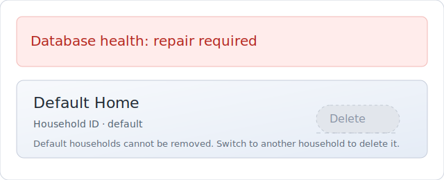

# Household database remediation

Household cascades, database health checks, and repair commands share the same
plumbing. Use this playbook when a support ticket reports blocked writes or a
red banner in Settings.

## 1. Identify the problem

- **UI symptoms:** Settings → Households shows a red "Database health" banner
  and the Delete action for the default household stays disabled. The banner
  links to repair controls and should match the screenshot below.
  
- **CLI symptoms:** Commands fail with `DB_UNHEALTHY_WRITE_BLOCKED` or the
  diagnostics summary reports `status: error`.
- **Logs:** Search the desktop logs for `household_delete_progress` and
  `cascade_state` entries to confirm the cascade paused mid-flight.

## 2. Inspect state

1. Run the bundled helper script to capture per-household counts and health
   information:

   ```bash
   scripts/dev/household_stats.sh
   ```

   Example output:

   ```
   Household ID   Name             Default  notes  events  files  bills  policies  inventoryItems  cascade  vacuum  health
   default        Default Home     yes          4       2      1      0         0               0        0       0  healthy
   hhd-24722      Detached Annex   no           96      78     12      5         3               9      742       1  cascade_pending
   ```

   The script exits non-zero if any household health column is not `healthy`.
   On Windows call `scripts/dev/household_stats.ps1` instead. Both wrappers call
   the `diagnostics household-stats` CLI endpoint and annotate the results with
   cascade/vacuum state.
2. If shell access is unavailable, open the desktop Diagnostics → Households
   view and capture the same table as a screenshot for the ticket.

## 3. Repair

- Prefer the in-app button: Settings → Households → "Run Repair / Re-check".
  
  The UI streams cascade progress while the repair loop runs and retries every
  two seconds until the checkpoint clears.
- CLI alternative:

  ```bash
  cargo run --manifest-path src-tauri/Cargo.toml --bin arklowdun -- diagnostics household-stats --json
  ```

  (Use the scripts above to wrap the command on customer machines.)
- Watch the cascade HUD. A paused or resumed run shows a yellow progress state
  before returning to green.
  

## 4. Verify

- Re-run `scripts/dev/household_stats.sh`. All households should report `health`
  as `healthy` and the `cascade` column should read `0`.
- Refresh Settings. The banner should disappear and the "Reclaim space" button
  should only appear when `vacuum` reports a pending entry.
- Confirm the application log includes `household_delete_resume` with
  `result="ok"` for the repaired household.

### Post-repair checklist

- [ ] Default household still exists (`id = "default"`, `is_default = 1`).
- [ ] No cascade checkpoint rows remain in `diagnostics_household_stats` output.
- [ ] Optional: trigger the "Reclaim space" button if `vacuum` reported `1`.

## 5. Escalate

If the health state remains `error` after repair:

1. Capture a fresh backup so engineers can reproduce locally:

   ```bash
   cargo run --manifest-path src-tauri/Cargo.toml --bin arklowdun -- db backup --json
   ```

   Note the emitted archive path.
2. Collect the log bundle referenced in Diagnostics → Summary. Attach both to
   the ticket.
3. Share the outputs above plus any user actions that triggered the cascade.

For background on cascade order, health gates, and repair internals see
[`docs/integrity-rules.md`](../integrity-rules.md#household-integrity).
